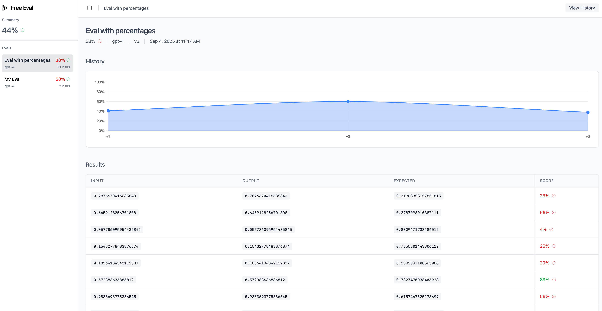
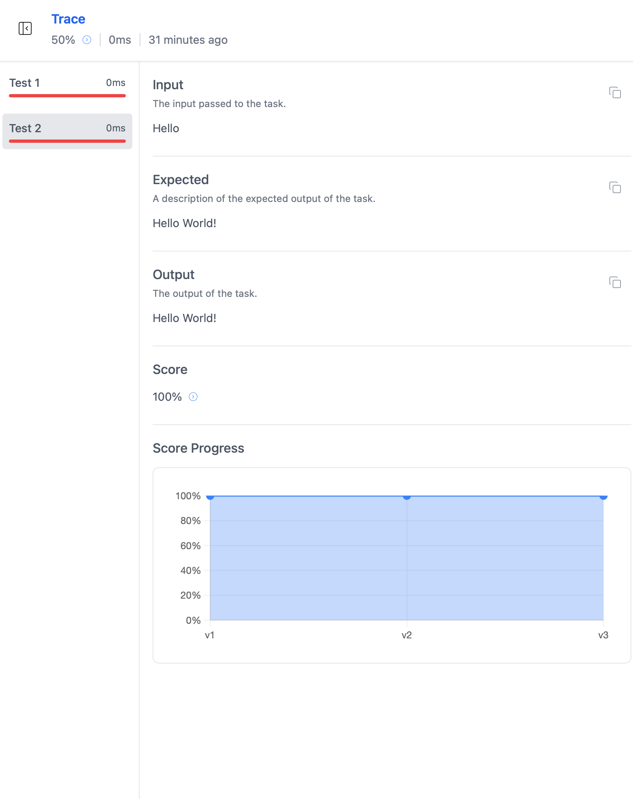

# Free Eval

A simple, flexible, and self-hostable evaluation framework for AI/LLM models. Store, test, and visualize AI evaluations without technology constraints - keeping it free, flexible, and under your control.

## Why Free Eval?

Free Eval provides a straightforward way to:
- **Store** evaluation results with version tracking and progress monitoring
- **Test** AI models with custom scoring functions and input generation
- **Visualize** results through a built-in web dashboard with charts and progress tracking
- **Self-host** everything on your own infrastructure without external dependencies
- **Customize** storage backends through a simple repository interface

## Features

- ✅ **Version Management**: Automatic version incrementing for tracking model improvements
- ✅ **Input Fingerprinting**: SHA-256 hashing enables tracking same inputs across versions
- ✅ **Flexible Scoring**: Supports both boolean (pass/fail) and numeric (0-100) scoring
- ✅ **TypeScript Support**: Fully typed with generics for Input, Output, and Expected types
- ✅ **Custom Storage**: Repository pattern allows any storage backend implementation
- ✅ **Web Dashboard**: Built-in visualization and progress monitoring
- ✅ **Self-Hostable**: Run entirely on your own infrastructure
- ✅ **Free**: Completely free to use, no strings attached

### Eval Groups Dashboard



It shows the progress over time of a whole group giving you access to the past versions if needed.

### Eval Details



Displays the details of an individual run, if there are others with the same input fingerprint it will show also a chart with the progress over time.

## Quick Start

### Basic Usage

```typescript
import { EvalDomain } from "./domain/eval.ts";
import { DbEvalRepository } from "./infrastructure/eval.ts";

const evalRepository = new DbEvalRepository()
// Domain can receive any instance of EvalRepository
const evalDomain = new EvalDomain(evalRepository);

await evalDomain.run({
  name: "My Eval",              // Eval group name
  model: "gpt-4",              // Model identifier
  getInputs: async () => {     // Function returning test inputs
    return [
      { input: "Hello", expected: "Hello World!" },
      { input: "Hi", expected: "Hi World!" },
    ];
  },
  task: async (input) => {     // Your AI task implementation
    // TODO: Replace with your LLM call
    return input + " World!";
  },
  scorer: async (input, output, expected) => {  // Scoring function
    return output === expected ? 1 : 0;         // Boolean or numeric scores
  },
});
```

### Configuration Options

- **`name`**: Evaluation group identifier (string)
- **`model`**: Model name or version being evaluated (string)
- **`getInputs`**: Async function returning array of test cases with `input` and optional `expected` values
- **`task`**: Async function that performs the AI task - replace with your LLM API calls
- **`scorer`**: Async function that calculates scores - supports boolean (pass/fail) or numeric (0-100) scoring

### Example with Percentage Scoring

```typescript
await evalDomain.run({
  name: "Classification Eval",
  model: "claude-3",
  getInputs: async () => {
    return [
      { input: "This movie is great!", expected: "positive" },
      { input: "This movie is terrible!", expected: "negative" },
    ];
  },
  task: async (input) => {
    // Your sentiment classification call
    return await classifysentiment(input);
  },
  scorer: async (input, output, expected) => {
    // Return confidence score (0-100)
    return calculateConfidenceScore(output, expected);
  },
});
```

## Custom Storage Implementation

In case you want to store the data in other ways you can implement the `EvalRepository` interface to use your preferred storage backend:

```typescript
import { EvalRepository, EvalGroup, EvalRecord } from "./core/eval.ts";

class CustomEvalRepository implements EvalRepository {
  async getMaxVersion(name: string): Promise<number> {
    // Your implementation - return highest version number for eval name
  }

  async createEvalGroup(evalGroup: Omit<EvalGroup, "id">): Promise<EvalGroup> {
    // Your implementation - store eval group and return with ID
  }

  async saveEvalRecord(evalRecord: Omit<EvalRecord, "id">): Promise<void> {
    // Your implementation - store individual evaluation record
  }

  // Additional methods for web dashboard (optional)
  async getAllEvalGroups(): Promise<EvalGroup[]> { /* ... */ }
  async getEvalGroupDetails(groupId: string): Promise</* ... */> { /* ... */ }
  // ... other dashboard methods
}

// Use your custom repository
const evalDomain = new EvalDomain(new CustomEvalRepository());
```

## Database Configuration

Free Eval uses SQLite with Drizzle ORM and supports both local and remote LibSQL databases. Configure using environment variables:

### Local SQLite Database (Default)
```bash
# Uses database.db in current directory (default)
deno run -A your-app.ts

# Custom local database path
DATABASE_PATH=./data/my-database.db deno run -A your-app.ts
```

### Remote LibSQL Database
```bash
# Using full database URL
DATABASE_URL=libsql://your-db.turso.io deno run -A your-app.ts

# With authentication token
DATABASE_URL=libsql://your-db.turso.io DATABASE_AUTH_TOKEN=your-token deno run -A your-app.ts

# With username and password
DATABASE_USER=myuser DATABASE_PASSWORD=mypass deno run -A your-app.ts
```

### Environment Variables
- `DATABASE_PATH` - Local SQLite file path (default: `database.db`)
- `DATABASE_URL` - Full database URL (overrides DATABASE_PATH)
- `DATABASE_USER` - Database username
- `DATABASE_PASSWORD` - Database password
- `DATABASE_AUTH_TOKEN` - LibSQL authentication token

## Web Dashboard

The framework includes a built-in web dashboard for visualizing results:

- **Evaluation Groups**: View all your evaluation runs with latest scores
- **Version History**: Track model performance improvements over time  
- **Detailed Results**: Inspect individual test cases with inputs, outputs, and scores
- **Progress Charts**: Visual representation of score trends across versions
- **Input Tracking**: See how specific inputs perform across different model versions

### Running the Dashboard

#### Using Docker
```bash
# Clone the repository
git clone https://github.com/RodrigoSaint/free-eval
# Build the image
docker build -t free-eval-dashboard .
# Run the dashboard using Docker
docker run -p 8080:8080 -v $(pwd)/database.db:/app/database.db free-eval-dashboard

# Access dashboard at http://localhost:8080
```

## Architecture

Free Eval follows clean architecture principles:

- **Core Layer** (`core/eval.ts`): Interfaces and data structures
- **Domain Layer** (`domain/eval.ts`): Business logic and evaluation orchestration  
- **Infrastructure Layer** (`infrastructure/eval.ts`): Storage implementations and external integrations


## License

MIT