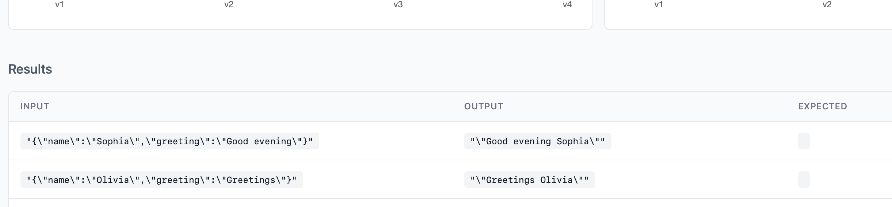
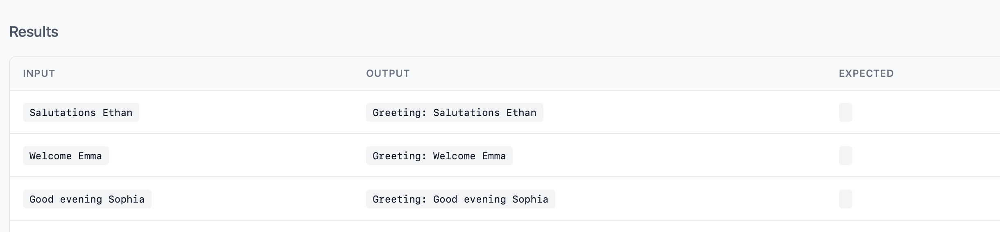

# Free Eval

A simple, flexible, and self-hostable evaluation framework for AI/LLM models. Store, test, and visualize AI evaluations without technology constraints - keeping it free, flexible, and under your control.

## Why Free Eval?

Free Eval provides a straightforward way to:
- **Store** evaluation results with version tracking and progress monitoring
- **Test** AI models with custom scoring functions and input generation
- **Visualize** results through a built-in web dashboard with charts and progress tracking
- **Self-host** everything on your own infrastructure without external dependencies
- **Customize** storage backends through a simple repository interface

## Features

- ✅ **Version Management**: Automatic version incrementing for tracking model improvements
- ✅ **Input Fingerprinting**: SHA-256 hashing enables tracking same inputs across versions
- ✅ **Flexible Scoring**: Supports both boolean (pass/fail) and numeric (0-100) scoring
- ✅ **TypeScript Support**: Fully typed with generics for Input, Output, and Expected types
- ✅ **Custom Storage**: Repository pattern allows any storage backend implementation
- ✅ **Web Dashboard**: Built-in visualization and progress monitoring
- ✅ **Self-Hostable**: Run entirely on your own infrastructure
- ✅ **Free**: Completely free to use, no strings attached

### Eval Groups Dashboard


It shows the progress over time of a whole group giving you access to the past versions if needed.

### Eval Details


Displays the details of an individual run, if there are others with the same input fingerprint it will show also a chart with the progress over time.

## Quick Start

### Basic Usage

```typescript
import { EvalDomain, DbEvalRepository } from "@rodrigosaint/free-eval";

const evalRepository = new DbEvalRepository()
// Domain can receive any instance of EvalRepository
const evalDomain = new EvalDomain(evalRepository);

await evalDomain.run({
  name: "My Eval",              // Eval group name
  model: "gpt-4",              // Model identifier
  getInputs: async () => {     // Function returning test inputs
    return [
      { input: "Hello", expected: "Hello World!" },
      { input: "Hi", expected: "Hi World!" },
    ];
  },
  task: async (input) => {     // Your AI task implementation
    // TODO: Replace with your LLM call
    return input + " World!";
  },
  scorer: async (input, output, expected) => {  // Scoring function
    return output === expected ? 1 : 0;         // Boolean or numeric scores
  },
});
```

### Configuration Options

- **`name`**: Evaluation group identifier (string)
- **`model`**: Model name or version being evaluated (string)
- **`getInputs`**: Async function returning array of test cases with `input` and optional `expected` values
- **`task`**: Async function that performs the AI task - replace with your LLM API calls
- **`scorer`**: Async function that calculates scores - supports boolean (pass/fail) or numeric (0-100) scoring
- **`thresholds`** (optional): Score thresholds for color-coding results in the dashboard
- **`concurrency`** (optional): Number of concurrent operations to run (default: 1)
- **`delay`** (optional): Milliseconds to wait between requests (default: 0)

### Example with Percentage Scoring

```typescript
await evalDomain.run({
  name: "Classification Eval",
  model: "claude-3",
  concurrency: 5,      // Run 5 evaluations concurrently
  delay: 1000,         // Wait 1 second between requests
  getInputs: async () => {
    return [
      { input: "This movie is great!", expected: "positive" },
      { input: "This movie is terrible!", expected: "negative" },
    ];
  },
  task: async (input) => {
    // Your sentiment classification call
    return await classifysentiment(input);
  },
  scorer: async (input, output, expected) => {
    // Return confidence score (0-100)
    return calculateConfidenceScore(output, expected);
  },
});
```

### Threshold Configuration

Free Eval supports configurable score thresholds that determine color-coding in the web dashboard:

- **🔴 Red**: Below average score (poor performance)
- **🟡 Yellow**: Average score (acceptable performance) 
- **🟢 Green**: Good score (excellent performance)

```typescript
await evalDomain.run({
  name: "Greetings eval",
  model: "gpt-4",
  genericPrompt: "Generate a greeting to the user [name]",
  thresholds: {
    averageScore: 60,  // Yellow background for scores >= 60
    goodScore: 80      // Green background for scores >= 80
  },
  getInputs: async () => {
    return [
      { input: {name: "Rodrigo", greeting: "Hey"} },
      { input: {name: "John", greeting: "Hi"} },
      { input: {name: "Susan", greeting: "Sup"} },
      // ... more test cases
    ];
  },
  task: async (input) => {
    // Your LLM call here
    return `${input.greeting} ${input.name}`;
  },
  scorer: async (input, output) => {
    const greetings = ["Hello", "Hi", "Hey", "Good morning", "Good evening"];
    let score = 0;
    if(output.includes(input.name)) score += 50;
    if(greetings.some(greeting => output.startsWith(greeting))) score += 50;
    if(greetings.some(greeting => output.endsWith(greeting))) score -= 30;
    return score; // Returns 0-100 score
  },
});
```

**Default Thresholds**: If not specified, the system uses `averageScore: 60` and `goodScore: 80`.

**Dashboard Color Coding**:
- Scores below `averageScore` (60) → **Red text/background**
- Scores between `averageScore` (60) and `goodScore` (80) → **Yellow text/background**  
- Scores at or above `goodScore` (80) → **Green text/background**

## Input/Output Formatting

Free Eval supports optional formatting functions to display more readable inputs and outputs in the web dashboard. This is particularly useful when working with complex data structures that need human-friendly representation.

### Configuration

You can provide optional `formatInputs` and `formatOutputs` functions in your evaluation configuration:

```typescript
await evalDomain.run({
  name: "Greetings eval",
  model: "gpt-4",
  formatInputs(input) { 
    return `${input.greeting} ${input.name}`;
  },
  formatOutputs(output) { 
    return `Greeting: ${output}`;
  },
  getInputs: async () => {
    return [
      { input: {name: "Rodrigo", greeting: "Hey"} },
      { input: {name: "John", greeting: "Hi"} },
      { input: {name: "Susan", greeting: "Sup"} },
      // ... more test cases
    ];
  },
  task: async (input) => {
    return `${input.greeting} ${input.name}`;
  },
  scorer: async (input, output) => {
    // Your scoring logic here
    return score;
  },
});
```

**Without Formatting**:


**With Formatting**:


This makes complex evaluation results much more readable while preserving all original data for analysis.

## Custom Storage Implementation

In case you want to store the data in other ways you can implement the `EvalRepository` interface to use your preferred storage backend:

```typescript
import { EvalRepository, EvalGroup, EvalRecord } from "@rodrigosaint/free-eval";

class CustomEvalRepository implements EvalRepository {
  async getMaxVersion(name: string): Promise<number> {
    // Your implementation - return highest version number for eval name
  }

  async createEvalGroup(evalGroup: Omit<EvalGroup, "id">): Promise<EvalGroup> {
    // Your implementation - store eval group and return with ID
  }

  async saveEvalRecord(evalRecord: Omit<EvalRecord, "id">): Promise<void> {
    // Your implementation - store individual evaluation record
  }

  // Additional methods for web dashboard (optional)
  async getAllEvalGroups(): Promise<EvalGroup[]> { /* ... */ }
  async getEvalGroupDetails(groupId: string): Promise</* ... */> { /* ... */ }
  // ... other dashboard methods
}

// Use your custom repository
const evalDomain = new EvalDomain(new CustomEvalRepository());
```

## Database Configuration

Free Eval uses SQLite with Drizzle ORM and supports both local and remote LibSQL databases. Configure using environment variables:

### Creating the database

Run the dashboard. It will create the database and run the necessary migrations for you. If you need to change its location follow the instructions below

### Local SQLite Database (Default)
```bash
# Uses database.db in current directory (default)
deno run -A your-app.ts

# Custom local database path
DATABASE_PATH=./data/my-database.db deno run -A your-app.ts
```

### Remote LibSQL Database
```bash
# Using full database URL
DATABASE_URL=libsql://your-db.turso.io deno run -A your-app.ts

# With authentication token
DATABASE_URL=libsql://your-db.turso.io DATABASE_AUTH_TOKEN=your-token deno run -A your-app.ts

# With username and password
DATABASE_USER=myuser DATABASE_PASSWORD=mypass deno run -A your-app.ts
```

### Environment Variables
- `DATABASE_PATH` - Local SQLite file path (default: `database.db`)
- `DATABASE_URL` - Full database URL (overrides DATABASE_PATH)
- `DATABASE_USER` - Database username
- `DATABASE_PASSWORD` - Database password
- `DATABASE_AUTH_TOKEN` - LibSQL authentication token

## Web Dashboard

The framework includes a built-in web dashboard for visualizing results:

- **Evaluation Groups**: View all your evaluation runs with latest scores
- **Version History**: Track model performance improvements over time  
- **Detailed Results**: Inspect individual test cases with inputs, outputs, and scores
- **Progress Charts**: Visual representation of score trends across versions
- **Input Tracking**: See how specific inputs perform across different model versions

### Running the Dashboard

#### Using Docker
```bash
# Clone the repository
git clone https://github.com/RodrigoSaint/free-eval

# Build the image
docker build -t free-eval-dashboard .

#Create the database file
touch database.db

# Run the dashboard using Docker
docker run -p 8080:8080 -v $(pwd)/database.db:/app/database.db free-eval-dashboard

# Access dashboard at http://localhost:8080
```

## Architecture

Free Eval follows clean architecture principles:

- **Core Layer** (`core/eval.ts`): Interfaces and data structures
- **Domain Layer** (`domain/eval.ts`): Business logic and evaluation orchestration  
- **Infrastructure Layer** (`infrastructure/eval.ts`): Storage implementations and external integrations


## License

MIT